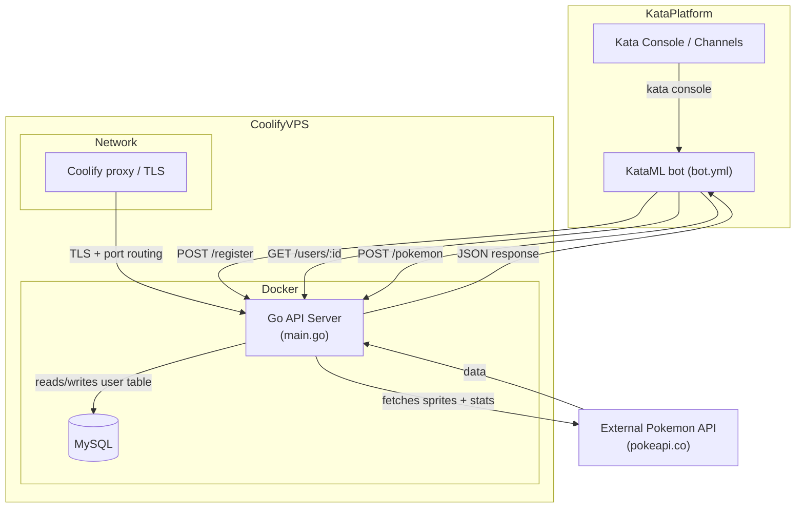

# Architecture Overview

The diagram below represents the full runtime stack: the KataML chatbot flows defined in `bot.yml`, the Go API service (inside Docker on Coolify), the MySQL store, and the external Pokemon API. Data flows include user registration, lookup, and Pokemon lookups.

## Components in detail

- **KataML bot (`bot.yml`)** defines the `greetings` flow (ask name, confirm, save via `/register`) and the `pokeInfo` flow (ask for a Pokémon, call `/pokemon`). `nlus` include keywords for greetings, yes/no answers, and the Pokémon trigger.
- **Kata console / channels** represent any channel that talks to Kata (console, Telegram, etc.) and provides user input into the defined intents.
- **Coolify VPS** hosts both Docker containers and handles networking/port routing through its gateway. In Coolify you can define environment variables (DB credentials, API host) which map directly to the Go server and Docker network.
- **Go API service (`main.go`)** exposes `/api/v1/register` (stores names), `/api/v1/users`, `/api/v1/users/:id` (used by the bot to check returning users), `/api/v1/pokemon` (calls the external Pokemon API), and `/health`. It connects to MySQL and keeps the schema described in `main.go`.
- **MySQL container** inside Coolify stores registered users (`id`, `name`, `created_at`). The Go service uses `database/sql` with the official MySQL driver and creates the table on startup.
- **External Pokemon API** (`pokeapi.co`) returns the Pokémon details (name, types, height, weight, sprites). The Go service normalizes that into `{success: true, data: {...}}` or `{success: false, message: "not found"}` so the KataML bot can render the proper text/image or send the “sorry” fallback.

## Flow highlights

- The KataML bot triggers `saveUserInfo` (POST register) after confirming a name—this keeps the MySQL store up to date and enables future checks.
- When the user asks for Pokémon info, the `callPokeAPI` action hits `/api/v1/pokemon`, and `explainPokemon`/`pokeImage`/`pokeLost` render conditional responses based on the returned `success` flag.
- All API calls go through Coolify’s network gateway, so when deploying make sure the Kata bot (running inside Coolify or remote) can hit the exposed API endpoint with the correct TLS certificate.
